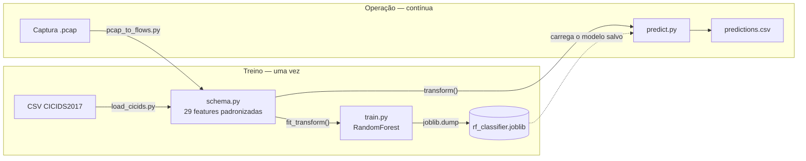
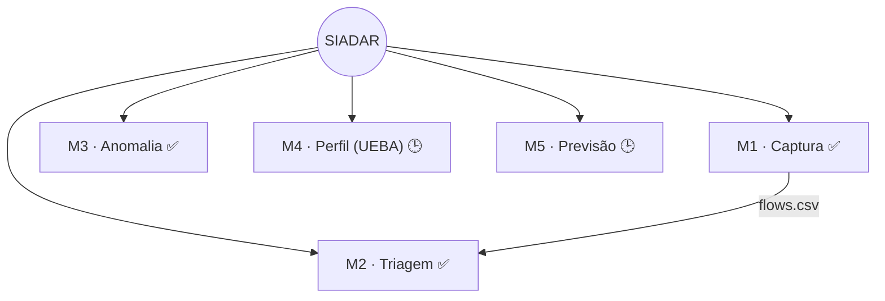

# SIADAR

**Sistema Inteligente de Análise, Detecção de Anomalias e Resposta em Redes Corporativas**

> Detecção de anomalias de rede baseada em machine learning, construída sobre uma
> pilha 100% open-source — pensada para operações que precisam de visibilidade
> real sobre o próprio tráfego sem o custo de licenciamento de um SIEM corporativo.

**Autoria:** R.D.S. · **Licença:** proprietária, uso e distribuição restritos — ver [`LICENSE`](LICENSE).

---

## Sumário

- [O que é o SIADAR](#o-que-é-o-siadar)
- [Impacto no ambiente corporativo](#impacto-no-ambiente-corporativo)
- [Arquitetura](#arquitetura)
- [Prova de conceito — o que já funciona](#prova-de-conceito--o-que-já-funciona)
- [Como o sistema pensa](#como-o-sistema-pensa)
- [Módulo complementar — verificação de arquivos](#módulo-complementar--verificação-de-arquivos)
- [Instalação](#instalação)
- [Uso](#uso)
- [Testes](#testes)
- [Limitações conhecidas](#limitações-conhecidas)
- [Roadmap](#roadmap)
- [Material de apoio](#material-de-apoio)
- [Direitos autorais e licenciamento](#direitos-autorais-e-licenciamento)

---

## O que é o SIADAR

O SIADAR é uma plataforma de monitoramento de tráfego de rede que combina quatro
capacidades sob uma mesma arquitetura modular:

| Módulo | Função | Status |
|---|---|---|
| **M1 — Captura** | Agrega pacotes de rede em *flows* e extrai features padronizadas | ✅ Implementado e testado |
| **M2 — Triagem** | Classifica o tipo de tráfego (Web, Streaming, VoIP, malicioso...) com Random Forest | ✅ Implementado e testado |
| **M3 — Anomalia** | Detecção não-supervisionada de comportamento anômalo (Isolation Forest) | ✅ Implementado e testado |
| **M4 — Perfil (UEBA)** | Baseline comportamental por usuário/host e detecção de desvios | 🕒 Roadmap |
| **M5 — Previsão** | Antecipação de falhas e vulnerabilidades de rede | 🕒 Roadmap |

A arquitetura foi desenhada para **adoção incremental**: cada módulo entra em
operação de forma independente, sem exigir que o pipeline inteiro esteja pronto
antes de gerar valor.

## Impacto no ambiente corporativo

Toda empresa com rede é alvo — poucas têm orçamento para se defender como uma
grande conta. Relatórios anuais do setor (ex.: *IBM Cost of a Data Breach*)
apontam custo médio global de incidente acima de US$ 4 milhões, boa parte
decorrente do tempo até detectar e conter o ataque. Ao mesmo tempo, soluções
corporativas de SIEM/XDR tradicionalmente cobram por volume de dados ingerido
e exigem projetos de implantação de meses.

*(Números de contexto de mercado citados de forma aproximada e ilustrativa, a
partir de relatórios públicos do setor — não são medições do SIADAR.)*

O SIADAR não se propõe a substituir uma plataforma corporativa global — não
tem a maturidade nem a escala comprovada de um fornecedor com décadas de
operação. A proposta é outra: **reduzir a fricção para quem hoje não tem
alternativa nenhuma.**

| Dimensão | SIADAR | SIEM / XDR corporativo tradicional |
|---|---|---|
| Licenciamento | Pilha open-source, sem custo de licença do motor de ML | Contratos anuais, geralmente por volume de dados ingerido |
| Implantação | Modular — adota-se módulo a módulo, com ganho mensurável a cada etapa | Projeto único e amplo, meses até o primeiro valor |
| Customização | Código aberto, features e modelo ajustáveis ao tráfego real da empresa | Customização dentro dos limites do plano contratado |
| Maturidade / escala | Prova de conceito validada em dataset público; piloto supervisionado é o próximo passo | Escala global comprovada, suporte 24/7, décadas de operação |

**Onde o valor aparece, na prática:**

- **Automação do triado** — captura, extração de features e classificação
  rodam em pipeline; o time deixa de olhar pacote por pacote e passa a revisar
  exceções.
- **Sem lock-in** — comece pelos módulos de captura e triagem, meça o
  resultado, e só então decida investir em anomalia, perfil e previsão.
- **Código auditável** — sem caixa-preta: pipeline, features e lógica de
  decisão ficam abertos para auditoria interna e compliance.
- **Custo alinhado ao risco** — sem cobrança por GB ingerido: o custo de
  operar é o custo de infraestrutura, não uma régua comercial que penaliza o
  crescimento da empresa.

Um protótipo de painel operacional (dashboard) ilustrando como essas
informações chegam ao time de segurança no dia a dia está em
[`docs/pitch-comercial.html`](docs/pitch-comercial.html).

## Arquitetura

Duas portas de entrada — um dataset público e uma captura ao vivo — convergem
para o mesmo conjunto de 29 features padronizadas (`siadar.features.schema`).
É essa peça em comum que permite treinar com dado público e aplicar o modelo
resultante sobre tráfego real, sem retrabalho:



O modelo treinado (`rf_classifier.joblib`) é a ponte: nasce da coluna de
treino (CSV público) e é consumido pela coluna de operação (captura ao vivo) —
só funciona porque as duas colunas falam o mesmo "idioma" de features.

Visão dos cinco módulos e como se relacionam:



Estrutura de código:

```
src/siadar/
  features/schema.py       # lista canônica de features, compartilhada por captura e treino
  capture/pcap_to_flows.py # Módulo 1: agrega pacotes de um .pcap em flows
  data/load_cicids.py      # carrega e normaliza os CSVs do CICIDS2017
  classification/
    preprocess.py          # encoding + StandardScaler
    train.py                # treino do Random Forest (baseline ou com RandomizedSearchCV)
    predict.py              # aplica um modelo treinado a novos flows
  anomaly/
    preprocess.py          # StandardScaler (sem encoding de label -- nao-supervisionado)
    train.py                # treino do Isolation Forest so com trafego BENIGN
    predict.py              # sinaliza flows anomalos com um modelo treinado
  filescan/
    scan.py                # modulo complementar: hash/entropia/extensao suspeita em arquivos
scripts/eda.py              # análise exploratória do dataset
tests/                      # testes unitários (pytest)
docs/                       # material visual: guia de uso e proposta comercial
```

## Prova de conceito — o que já funciona

O que está listado abaixo foi executado e verificado, não é projeção.

- **Pipeline de ponta a ponta** — captura → extração de features → treino →
  predição — validado tanto com dados sintéticos quanto com o **CICIDS2017
  real** (2.827.876 flows, 15 classes).
- **Suíte de testes automatizados** (`pytest` + `scapy`) cobrindo a agregação
  de pacotes em flows e o pipeline completo de treino/inferência.
- **Schema único de 29 features** compartilhado entre o carregador do dataset
  público e o extrator de captura ao vivo — a mesma peça de código garante que
  modelo treinado e tráfego capturado nunca "falem idiomas diferentes".

### Resultado real — Triagem de tráfego (M2, Random Forest + SMOTE sobre o CICIDS2017 completo)

| Classe | Precision | Recall | Amostras (teste) |
|---|---|---|---|
| BENIGN | 1.00 | 0.91 | 454.265 |
| DDoS | 1.00 | 1.00 | 25.605 |
| PortScan | 0.99 | 1.00 | 31.761 |
| DoS Hulk | 0.86 | 1.00 | 46.025 |
| Infiltration | 0.83 | 0.71 | 7 |
| SSH-Patator | 0.11 | 0.82 | 1.180 |
| Web Attack (Brute Force) | 0.17 | 0.46 | 301 |
| Bot | 0.03 | 0.99 | 391 |
| Web Attack (SQL Injection) | 0.00 | 0.50 | 4 |

**Accuracy geral: 93% · F1 ponderado: 0,95.** As classes bem representadas
seguem excelentes. Para as raras, testamos balancear o treino com **SMOTE**
(`imbalanced-learn`, superamostrando classes com menos de 10 mil exemplos)
— resultado real, não mágico: SSH-Patator e Web Attack (Brute Force)
melhoraram (precisão quase dobrou), Infiltration melhorou bastante, mas
**Bot não mudou nada** (precisão continua em 0,03 mesmo com 10 mil exemplos
sintéticos). Conclusão: para Bot, o problema não é falta de exemplos, é o
tráfego ser estatisticamente parecido demais com o normal nessas 29
features — SMOTE não resolve overlap de distribuição, só resolve escassez
de dados. Próximo passo real seria features adicionais específicas para
esse padrão, não mais dados sintéticos.

### Resultado real — Detecção de anomalias (M3, Isolation Forest treinado só com BENIGN)

**Accuracy: 73% · AUC-ROC: 0,82 · Recall em ataques: 46% · Precisão: 88%.**
A primeira versão (parâmetros padrão do scikit-learn) tinha AUC 0,74:
descobrimos que `max_samples="auto"` limita cada árvore a **256** amostras
por padrão — pouquíssimo diante de 1,59 milhão de flows normais de treino,
que cobrem tráfego bem heterogêneo (web, streaming, VoIP...). Subindo para
`max_samples=8192` (agora o padrão do módulo), a AUC saltou para 0,82 sem
tocar em nenhuma outra peça do sistema. Já recalibrar só o limiar de decisão
(`--contamination`) testamos antes e depois dessa mudança: sempre trocou
precisão por um pouco de recall, nunca moveu a AUC — ou seja, o ganho real
veio da árvore enxergar mais dado, não do limiar. Ainda é um detector
complementar, não autossuficiente (quase metade dos ataques passa batido
sozinho) — combinado com o M2 (que já classifica DDoS/PortScan/DoS com
quase 100% de acerto), a cobertura prática é maior que qualquer um dos dois
isolado.

Os relatórios completos (`classification_report`, matrizes de confusão)
estão em [`models/`](models/).

**Estágio de maturidade:**

`Prova de conceito ✅` → `Validação com dataset público real ✅` → `Piloto supervisionado 🕒` → `Produção monitorada 🕒`

## Como o sistema pensa

1. **Captura (M1)** lê um `.pcap` e agrupa pacotes por 5-tuple (IP/porta de
   origem e destino + protocolo) em *flows*, calculando duração, bytes e
   pacotes por direção, *inter-arrival time*, flags TCP e entropia do payload.
2. **Triagem (M2)** treina um Random Forest sobre o CICIDS2017 (dataset
   público de referência em pesquisa de IDS) para classificar o tipo de
   tráfego de cada flow, e aplica esse modelo a flows capturados ao vivo.
3. **Anomalia (M3)** treina um Isolation Forest **apenas com tráfego
   normal (BENIGN)** — nunca vê um ataque durante o treino, simulando o
   cenário real de produção, onde trafego malicioso rotulado normalmente
   não está disponível — e sinaliza qualquer flow que fuja desse padrão
   aprendido.
4. Os módulos 4 e 5 (roadmap) reutilizam a mesma base de features para
   perfil comportamental de usuários (UEBA) e predição de falhas — ver
   [Roadmap](#roadmap).

## Módulo complementar — verificação de arquivos

Diferente dos módulos 1-5 (que analisam **tráfego de rede**), `siadar.filescan`
analisa **arquivos em disco** — um domínio de segurança diferente, mais
parecido com um antivírus heurístico do que com um IDS. Não depende do
resto do pipeline.

```bash
python -m siadar.filescan.scan C:\Users\voce\Downloads -o varredura.csv
# com uma lista de hashes maliciosos conhecidos:
python -m siadar.filescan.scan D:\ --hashes hashes_maliciosos.txt --max-files 5000
```

Sinaliza um arquivo quando encontra:

- **hash conhecido** — SHA-256 bate com uma lista fornecida por você (o
  projeto não embute nenhuma base de malware);
- **entropia alta** — heurística clássica para arquivo compactado,
  criptografado ou empacotado (também dá falso positivo em `.zip`/`.jpg`
  legítimos — é um sinal, não uma prova);
- **extensão dupla suspeita** — ex.: `fatura.pdf.exe`;
- **executável em pasta de risco** — `.exe`/`.scr`/`.js` etc. em
  Downloads/Temp/Desktop.

**É um triador heurístico, não substitui um antivírus com base de
assinaturas atualizada.** Falsos positivos e falsos negativos são
esperados — trate os arquivos sinalizados como ponto de investigação, não
como veredito. O próprio comando imprime esse aviso quando encontra algo.

## Demo rápida (sem baixar o dataset real)

Quer ver o pipeline funcionando agora, sem baixar o CICIDS2017? Veja
[`demo/README.md`](demo/README.md) — gera dados e uma captura sintéticos e
roda captura → treino → predição de ponta a ponta com os mesmos comandos
reais do projeto.

## Instalação

```bash
python -m venv .venv
.venv\Scripts\activate
pip install -r requirements.txt
pip install -e .
```

## Uso

1. **Baixar o CICIDS2017** (CIC, Universidade de New Brunswick — busque "CICIDS2017 dataset"
   e baixe a pasta `MachineLearningCVE`, que contém os CSVs já processados pelo
   CICFlowMeter) e colocar em `data/raw/MachineLearningCVE/`.

2. **EDA**:
   ```bash
   python scripts/eda.py data/raw/MachineLearningCVE
   ```

3. **Treinar o classificador**:
   ```bash
   python -m siadar.classification.train data/raw/MachineLearningCVE --model-out models/rf_classifier.joblib
   # com busca de hiperparâmetros (mais lento):
   python -m siadar.classification.train data/raw/MachineLearningCVE --model-out models/rf_classifier.joblib --search
   ```

4. **Treinar o detector de anomalias** (aprende só com os flows `BENIGN` do mesmo dataset):
   ```bash
   python -m siadar.anomaly.train data/raw/MachineLearningCVE --model-out models/anomaly_model.joblib
   ```

5. **Capturar tráfego real e extrair flows**:
   ```bash
   # gerar um .pcap com tcpdump/Wireshark, depois:
   python -m siadar.capture.pcap_to_flows captura.pcap -o flows.csv
   ```

6. **Classificar os flows capturados** com o modelo treinado:
   ```bash
   python -m siadar.classification.predict models/rf_classifier.joblib flows.csv -o predictions.csv
   ```

7. **Sinalizar flows anômalos**:
   ```bash
   python -m siadar.anomaly.predict models/anomaly_model.joblib flows.csv -o anomalies.csv
   ```

## Testes

```bash
pytest
```

## Limitações conhecidas

- `payload_entropy` só é calculável a partir de captura real (payload bruto);
  o CICIDS2017 não disponibiliza o payload, então essa feature **não** é usada
  no classificador treinado sobre o dataset público — só fica disponível para
  os módulos futuros que rodarem sobre captura ao vivo.
- `pcap_to_flows.py` é um extrator de features simplificado, não um clone do
  CICFlowMeter — os valores numéricos podem divergir ligeiramente do dataset
  de treino em casos extremos (fragmentação, retransmissões).
- Timeout de flow fixo em 120s (mesma heurística do CICFlowMeter).
- O CICIDS2017 real tem classes severamente desbalanceadas (ex.: 391
  amostras de `Bot` contra 2,27 milhões de `BENIGN`). SMOTE (default no M2)
  ajuda quando o problema é escassez de exemplos (SSH-Patator, Web Attack
  Brute Force), mas não resolve quando o tráfego malicioso se sobrepõe
  estatisticamente ao normal nessas 29 features (`Bot`, que não melhorou
  nada) — ver [Prova de conceito](#prova-de-conceito--o-que-já-funciona).
- O detector de anomalias (M3) atinge AUC-ROC 0,82 no CICIDS2017 real —
  detecta menos da metade dos ataques sozinho, mesmo após ajustar
  `max_samples` (o ganho real veio daí, não de recalibrar o limiar
  `--contamination`, que só troca precisão por recall sem mover a AUC).
  Útil como sinal complementar ao M2, não como detector isolado.
- O dataset original do CICIDS2017 tem valores de `Flow Duration`
  negativos em algumas linhas (artefato conhecido do CICFlowMeter) —
  `load_cicids.py` não filtra isso hoje.
- O detector de anomalias (M3) é **sensível à escala das features**, ao
  contrário do classificador (M2): durante o desenvolvimento, um dataset de
  treino com unidades inconsistentes em relação ao extrator de captura real
  fazia até tráfego normal ser sinalizado como anômalo, mesmo com o
  classificador funcionando bem sobre os mesmos dados. Por isso o gerador de
  dados sintéticos (`demo/make_demo_dataset.py`) extrai o treino de tráfego
  simulado via `pcap_to_flows.py`, em vez de inventar valores de feature —
  ver [`demo/README.md`](demo/README.md). Ao treinar com o CICIDS2017 real
  isso não se aplica (é tudo extraído pelo mesmo CICFlowMeter).

## Roadmap

- [x] Módulo 1 — Captura e pré-processamento (flows a partir de pcap)
- [x] Módulo 2 — Classificação de tráfego (Random Forest baseline)
- [x] Módulo 3 — Detecção de anomalias (Isolation Forest)
- [x] Validação com o CICIDS2017 real (2,83M flows) — números em [Prova de conceito](#prova-de-conceito--o-que-já-funciona)
- [x] Balancear classes raras no M2 com SMOTE (ajudou SSH-Patator/Web Attack Brute Force; `Bot` continua precisão 0,03 — overlap de features, não escassez de dados)
- [x] Tunar hiperparâmetros do M3 (`max_samples`: AUC 0,74 → 0,82)
- [ ] Melhorar M2 além do SMOTE para classes com overlap de features (`Bot`) — provavelmente precisa de features novas
- [ ] Melhorar M3 além do teto de AUC 0,82 (novas features, ou testar Autoencoder/One-Class SVM)
- [ ] Módulo 4 — UEBA (baseline comportamental por usuário, clustering)
- [ ] Módulo 5 — Predição de falhas e vulnerabilidades
- [ ] Dashboard (Grafana ou Streamlit) para visualização em tempo real
- [ ] Piloto supervisionado com tráfego real de um ambiente corporativo

## Material de apoio

- [`docs/guia-visual.html`](docs/guia-visual.html) — guia ilustrado de uso e
  manutenção do sistema, em mapas mentais coloridos (abrir no navegador).
- [`docs/pitch-comercial.html`](docs/pitch-comercial.html) — proposta de valor
  e pitch executivo para tomadores de decisão, com o mockup do painel
  operacional (abrir no navegador).

## Direitos autorais e licenciamento

Este é um projeto autoral de **R.D.S.**. Todo o código, a documentação e o
material de proposta comercial neste repositório são protegidos por direitos
autorais e licenciados sob termos **proprietários e restritivos** — não é
software livre nem open-source.

**Não são permitidos**, sem autorização prévia e por escrito do autor:

- cópia, modificação ou redistribuição do código ou da documentação;
- revenda ou comercialização, total ou parcial, deste software;
- uso como base para produtos ou serviços derivados.

Os termos completos estão em [`LICENSE`](LICENSE). Para licenciamento
comercial ou parcerias, entre em contato: **dellasantacorporativo@gmail.com**.
